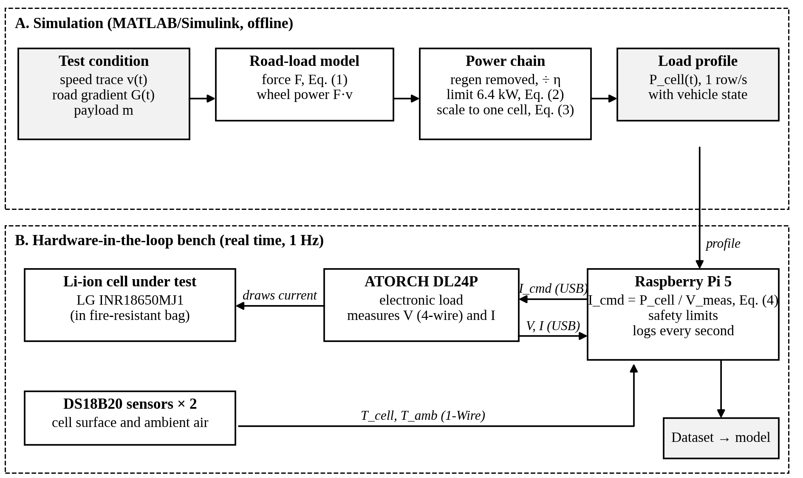
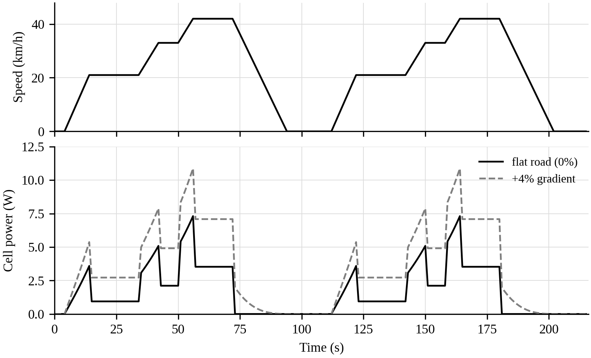

# RTEdge — Vehicle-Aware Battery Runtime Prediction for Electric Two-Wheelers

RTEdge predicts how long an electric two-wheeler's battery will last by combining the
battery's own signals (voltage, current, temperature) with the vehicle's riding conditions
(speed, acceleration, road gradient and payload). To train such a model, the project builds a
low-cost **hardware-in-the-loop (HIL) rig** that makes a real lithium-ion cell experience the
load it would see inside an electric scooter.

Final-year B.Tech project, Department of Electronics and Communication Engineering,
Motilal Nehru National Institute of Technology Allahabad.
Team: Satyam Tekriwal (group leader), Devanshi, Ankit Kumar. Guide: Dr. Yogendra Kumar Prajapati.

## Project phases

| Phase | Work | Status |
|---|---|---|
| 1 | Runtime-prediction benchmark on the NASA randomised battery-usage dataset (cell RW3) | Complete |
| 2 | Vehicle model, load-profile generation and HIL rig; controlled vehicle-aware dataset; vehicle-aware model | In progress |
| 3 | Bench-to-road validation on an instrumented electric scooter in Prayagraj | Planned |

### Phase 1 result (NASA RW3)

822 discharge trajectories, 1,474,100 samples, split by trajectory.

| Model | Test MAE (s) | Test R² |
|---|---:|---:|
| Linear regression | 426.90 | 0.47 |
| Random Forest (final) | 393.66 | 0.54 |

Tuning changed the error by less than 0.6 %: voltage, current and elapsed time explain only about
half of the variance, and 68 % of the temperature samples were invalid. Phase 2 therefore adds
vehicle information and a clean temperature record. Details: `documentation/PROGRESS_STAGE1_RTEdge.md`.

### Phase 2 method



1. **Simulation (MATLAB/Simulink, offline).** Each test condition (speed trace, gradient profile,
   payload) goes through a road-load model of the Ather 450X (3.5 kWh) and is scaled from the
   14S pack to one cell (equivalent parallel count 68.5 Ah / 3.40 Ah = 20.15). The output is a
   1 Hz per-cell power profile.
2. **Hardware (real time, 1 Hz).** A Raspberry Pi 5 replays the profile through an ATORCH DL24P
   electronic load on an LG INR18650MJ1 cell (I = P / V_measured every second), enforces the
   safety limits and logs voltage, current, temperatures and the vehicle state.
3. **Dataset.** 24 run-to-empty discharges covering 22 conditions (≈127 h, ≈4.6 lakh records).
4. **Model.** Random Forest with battery + temperature + vehicle-state inputs, compared against
   Coulomb counting and the Phase 1 battery-only model, with discharge-wise cross-validation.



Full write-up: `documentation/PROGRESS_STAGE2_RTEdge.md`.

## Repository layout

```text
data/nasa_raw/                 NASA RW3 data (not tracked - download, see below)
docs/                          reading material, reports, papers, Phase 2 figures
documentation/                 progress records and experiment log
hardware/                      bill of materials, wiring and safety notes for the rig
matlab/01_inspect_nasa/        Phase 1 - dataset inspection
matlab/02_battery_model/       Phase 1 - Simulink battery model
matlab/05_dataset_generation/  Phase 1 - dataset building, models and analysis
matlab/06_phase2_hil_profiles/ Phase 2 - vehicle model and load-profile generation
pi/                            Phase 2 - Raspberry Pi HIL runner
outputs/figures/               result figures
```

## Quick start

**Phase 1.** Download the *Randomized Battery Usage* dataset from the NASA Prognostics Center
of Excellence data repository, place `RW3.mat` in `data/nasa_raw/`, then run the scripts in
`matlab/05_dataset_generation/` (start with `build_rw3_dataset.m`).

**Phase 2 profiles.** In MATLAB (Simulink required, no extra blocksets):

```matlab
cd matlab/06_phase2_hil_profiles
phase2_smoke_test      % builds the model and checks one condition
run_phase2_batch       % writes profiles/<id>.csv and profiles/_manifest.csv
```

Every parameter lives in `phase2_config.m`. Replace the `[MEASURE]` values (cell capacity,
internal resistance) with your own bench measurements before the data campaign.

**Phase 2 rig.** See `pi/README.md` and `hardware/README.md`.
